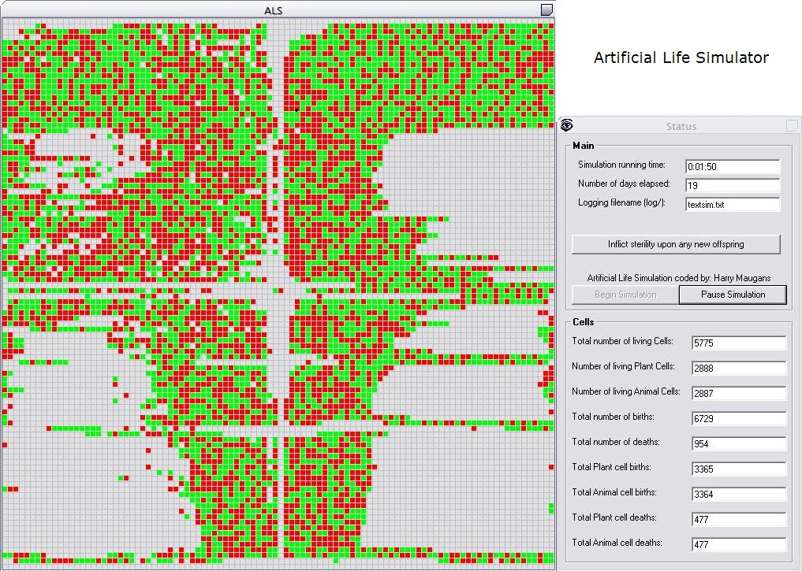



## Artificial Life Simulator

### Description

This is an application I designed to simulate the mitotic replication of single cellular organisms. It demonstrates this process with two types of cells, animals (Animalia) and plants (Plantae). When the simulation is initalized, the origional two cells (Adam and Eve) begin replicating, spawning new cells. The red tiles symbolize the animal cells and the green tiles symbolize the plant cells. Each cell is its own individual entity, and the only overhead there is in this simulation, is time itself. The cells are self-contained and constructed using a single class module (clsCell) which is manipulated into whatever type of cell is required. Every minute, the simulation data is appended to a log file which can be found in the "logs/" folder.I added in a sterility feature to show the parabolic bell curve created by a sudden loss in reproductive abilities. Other than that the code is fairly self-explanitory.
 
### More Info
 
In the following version I plan to include multithreading capabilities, as well as complex log data analyzation and interpretation to produce graphs of data and progress over time. I also plan on introducing virii and diseases that could hinder the replicating abilities of some of the cells (as of now, all cells have a 100% fertility rate).

             |
---                |---
**Submitted On**   |2002-05-26 22:48:38
**By**             |[Harry Maugans](https://github.com/Planet-Source-Code/PSCIndex/blob/master/ByAuthor/harry-maugans.md)
**Level**          |Intermediate
**User Rating**    |4.4 (44 globes from 10 users)
**Compatibility**  |VB 6\.0
**Category**       |[Complete Applications](https://github.com/Planet-Source-Code/PSCIndex/blob/master/ByCategory/complete-applications__1-27.md)
**World**          |[Visual Basic](https://github.com/Planet-Source-Code/PSCIndex/blob/master/ByWorld/visual-basic.md)
**Archive File**   |[Artificial872395262002\.zip](https://github.com/Planet-Source-Code/harry-maugans-artificial-life-simulator__1-35125/archive/master.zip)

